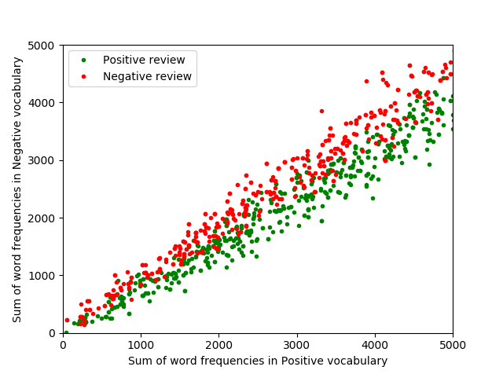
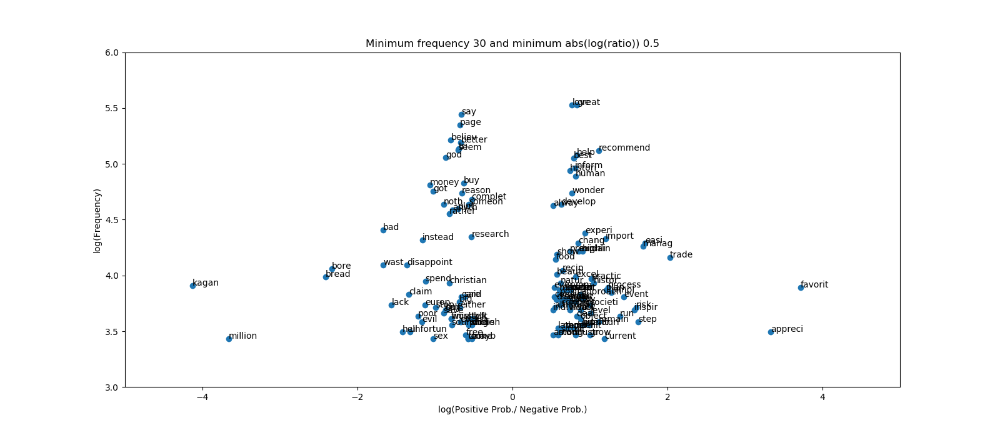

# Sentiment-Analysis-of-books-consumer-reviews

NLP techniques have been implemented to analyse the consumer reviews of books.

The data set used in this project is found in https://www.cs.jhu.edu/~mdredze/datasets/sentiment/index2.html

The different methods are outlined next:
* Sentiment classifier with Logistic Regression
* Sentiment classifier with Naive Bayes and visualisation of words frequency versus positive to negative probability ratio
* Word embeddings using CBOW and PCA to visualise word relationships

Prior to any analysis the words are pre-process. The pre-procesing of the body text of the reviews consists of the following steps:
1. Removing digits
2. Lowercasing
3. Removing punctuation
4. Tokenizing words
5. Remove stop words
6. Remove the word 'books' which frequency is much higher than the rest of words and can skew the results
7. Removing stop words.py
8. Stemming

The structure of the project is organized as follows:
* 'SA_utils.py': contains useful processing function common for the different methods of analysis
* 'SA_Logistic_Regression_classification.py': is a python script detailing the steps to develop a sentiment classifier using Logistic Regression where the algorithm is implemented from scratch
* 'SA_Naive_Bayes_classification.py': is a python script containing the implementation of a naive bayes classifier also implemented step by step. The negativity of positivity of words is visualise against their frequency using the ratio between the probability of words appearing in positive reviews and the probability of words appearing in negative reviews.
* 'SA_Word_Embeddings_CBOW.py': is a python script where the Continuous Bag of Words method to generate word vectors known as word embeddings has been implemented. A Principal Components Analysis is applied to the embeddings and the two first PCs are used for visualising relationships between words in as distances in a 2D map.

Each of the NLP techniques used in this project is further explained in the following sections.

## 1) Logistic Regression classifier
To implement the logistic regression classifier first a vocabulary containing all the different words that appear in the pre-processed reviews is built.
Then, for each word in the vocabulary, features characterising this word are extracted. The word features consist of a bias term with value of 1, followed by the frequency of the word in positive reveiws and finally the frequency of the word in negative reviews.

The word features are show in for the books reviews are illustrated below, showin the positive word features in green and the negative one in red. It is seen that the green points overlap with the red ones, which indicated that the classification is not straightforward. 

A logistic regresion classifier is implements using gradient descent. The model results in an accuracy of 83.6% approximately.

## 2) Naive Bayes classifier
The naive bayes classifier is based on the probability of the words appearing in a positive or negative review.
Laplacian smoothing has been applied to avoid instability issues.

The "positivity" of "negativity" of each word can be measured by the logarithmic ratio between the positive and negative probabilities of each word. Positive words will have a larger logarithmic positive value, whereas negetive words will result in a lerger negative value of the logarithmic ratio.
The "positivity" of "negativity" of the words is visualised against their logarithmic frequency, as shown in the graoh below. This informs of the most frequency used positive and negative words.

